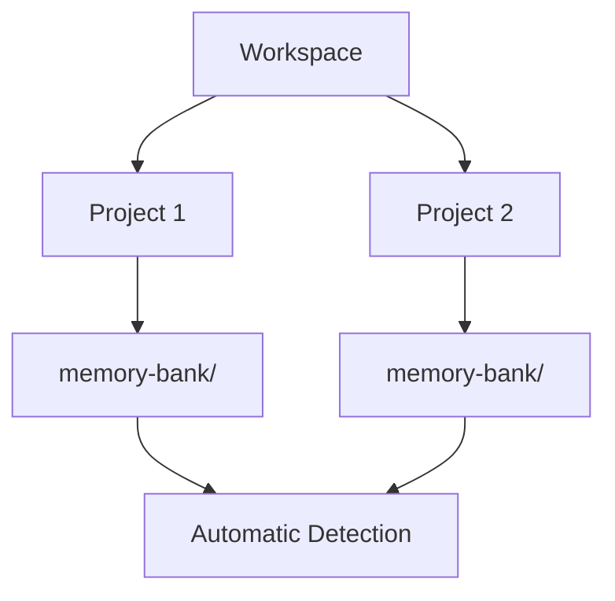
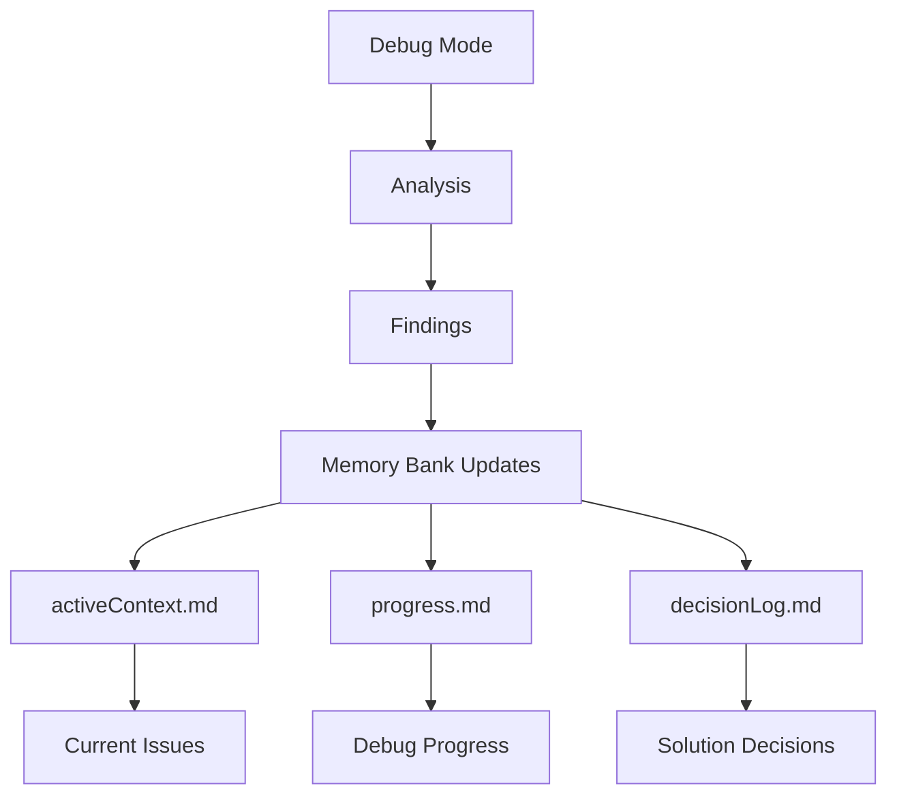

<div align="center">

# rools

**rools System for roo code custom prompts**

[](https://github.com/RooVetGit/Roo-Code)
[](https://www.npmjs.com/package/rools)

</div>

## 🎯 Overview

rools implements the **.roo file standard** for persistent AI context management. This structured memory system ensures consistent project understanding across development sessions with:

## 🚀 Quick Start

### 1. Install rools Package
```bash
npm install rools
```
This command installs the `rools` package which automatically extracts configuration files to your project root. Existing files with matching names will be overwritten.

### 2. Configure Custom Instructions


### File Organization

```
project-root/
├── .clinerules-architect
├── .clinerules-code
├── .clinerules-ask
├── .clinerules-debug
├── .roomodes
├── memory-bank/
│   ├── activeContext.md
│   ├── productContext.md
│   ├── progress.md
│   └── decisionLog.md
└── projectBrief.md
```
## 📦 Distribution & Installation

Install the `rools` package via npm:
```bash
npm install rools
```

Update the package using:
```bash
npm update rools
```

The package automatically extracts configuration files to your project root during installation/updates. Existing files with matching names will be overwritten.
- Structured documentation with clear purposes
- Technical decision tracking with rationale
- Automated progress monitoring
- Cross-referenced project knowledge

## 💡 Pro Tips

### Multiple Projects

Roo automatically handles multiple Memory Banks in your workspace!

### Debug Mode
Roo Code Memory Bank includes a powerful Debug mode for systematic troubleshooting and problem-solving. This mode operates with surgical precision, focusing on root cause analysis and evidence-based verification.

#### Key Capabilities
- 🔍 **Non-destructive Investigation**: Read-only access ensures system integrity during analysis
- 📊 **Diagnostic Tools**: Access to logging, tracing, and system analysis tools
- 🔬 **Systematic Analysis**: Methodical problem investigation and isolation
- 🎯 **Root Cause Identification**: Traces error propagation through all system layers
- ✅ **Evidence-based Verification**: Validates findings through multiple checkpoints

#### Real-time Update Triggers
Debug mode actively monitors and updates Memory Bank files based on:
- 🐛 Bug discoveries and error patterns
- 💾 Memory leaks and resource issues
- 🔄 Race conditions and deadlocks
- 📈 Performance bottlenecks
- 📝 Log analysis and trace outputs

#### Memory Bank Integration


Switch to Debug mode when you need to:
- Investigate system behavior
- Analyze failure patterns
- Isolate root causes
- Verify fixes
- Document debugging insights

### Session Management
- ⚡ **Real-time Updates**: Memory Bank automatically stays synchronized with your work
- 💾 **Manual Updates**: Use "UMB" or "update memory bank" as a fallback when:
  - Ending a session unexpectedly
  - Halting mid-task
  - Recovering from connection issues
  - Forcing a full synchronization

## 📖 Documentation

- [Developer Deep Dive](https://github.com/GreatScottyMac/roo-code-memory-bank/blob/main/developer-primer.md)
- [Update Log](https://github.com/GreatScottyMac/roo-code-memory-bank/blob/main/updates.md)

## 🛠️ System Prompts and Utilities

### System Prompt Files

The `.roo` directory contains system prompt files that define the behavior of Roo's different modes:

```
.roo/
├── example-system-prompt
├── system-prompt-architech
├── system-prompt-ask
├── system-prompt-code
└── system-prompt-debug
```

These files contain system variables that are used by Roo to understand your environment:

| Variable | Description |
|----------|-------------|
| `CURRENT_WORKING_DIRECTORY` | The current working directory of your project |
| `HOME_DIRECTORY` | Your home directory path |
| `GLOBAL_CUSTOM_MODES_PATH` | Path to global custom modes configuration |
| `OPERATING_SYSTEM` | Your operating system |
| `DEFAULT_SHELL` | Your default shell |

### Utility Scripts

The `scripts` directory contains utilities for managing system prompt files:

```
scripts/
├── populate-system-vars.js
└── wipe-system-vars.js
```

#### Populate System Variables

The `populate-system-vars.js` script automatically populates system variables in all system prompt files:

```bash
node scripts/populate-system-vars.js
```

This script:
- Detects your current system environment
- Updates all system-prompt files in the .roo directory
- Provides a summary of updated files

#### Wipe System Variables

The `wipe-system-vars.js` script removes values from system variables in all system prompt files:

```bash
node scripts/wipe-system-vars.js
```

This script:
- Clears all system variable values in system-prompt files
- Useful for preparing files for version control
- Preserves the structure of the files

---

<div align="center">

**[View on GitHub](https://github.com/GreatScottyMac/roo-code-memory-bank) • [Report Issues](https://github.com/GreatScottyMac/roo-code-memory-bank/issues) • [Get Roo Code](https://github.com/RooVetGit/Roo-Code)**

</div>

## Credits 
Huge shoutout to [GreatScottyMac](LICENSE) for the initial seed
## License

Apache 2.0 © 2025 
