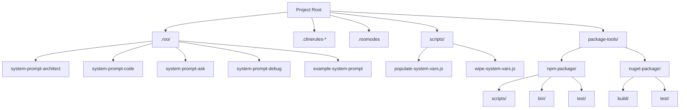
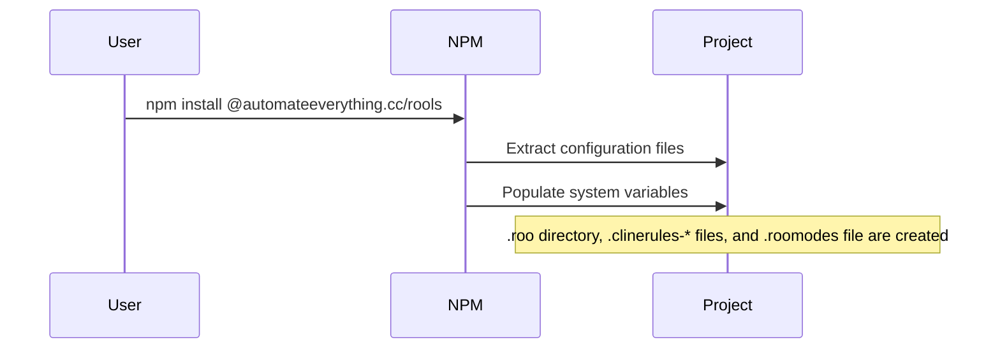
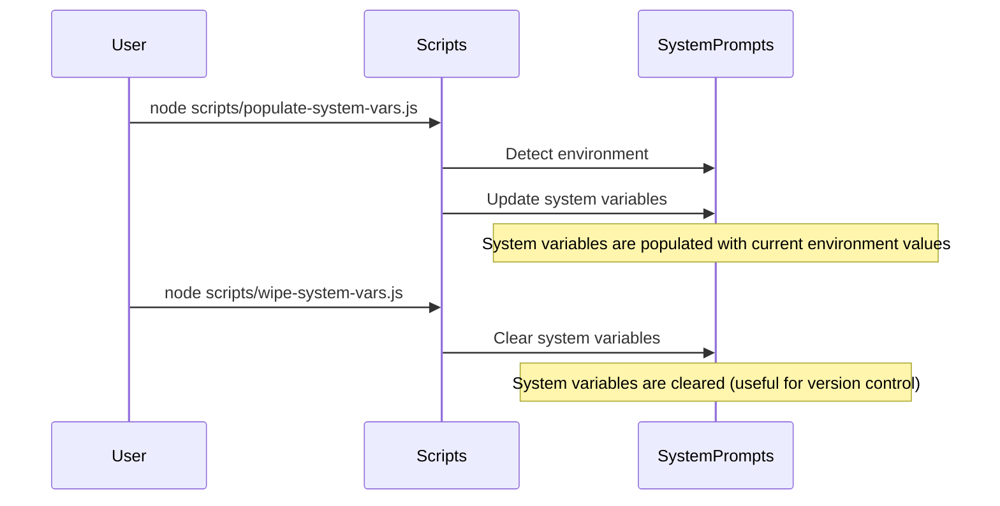
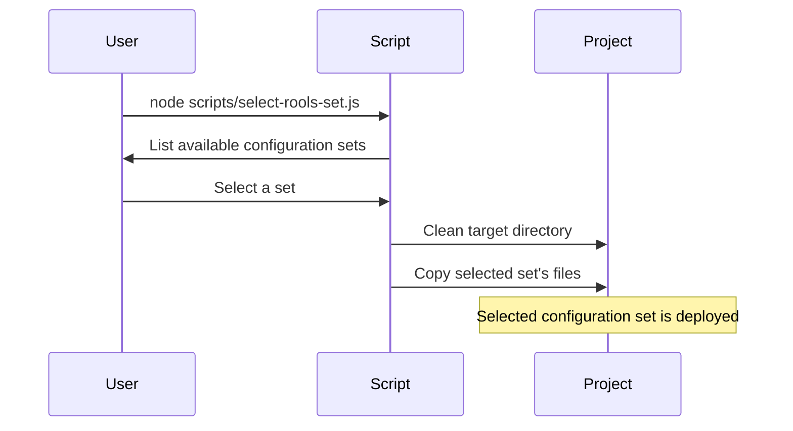
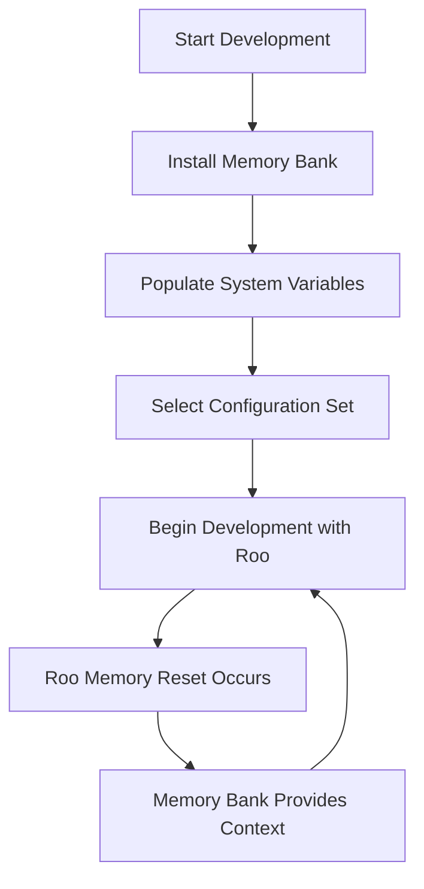
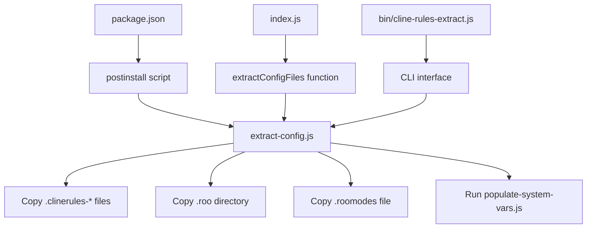
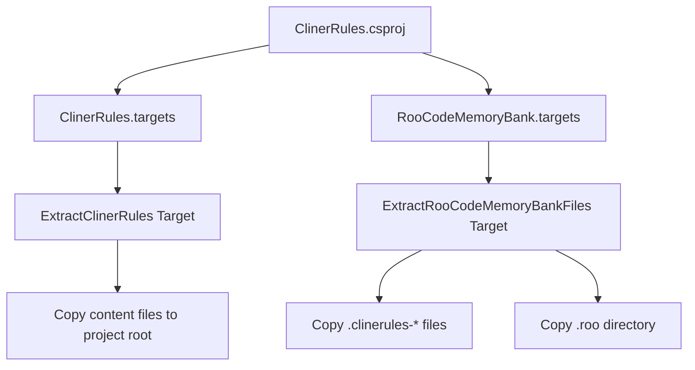
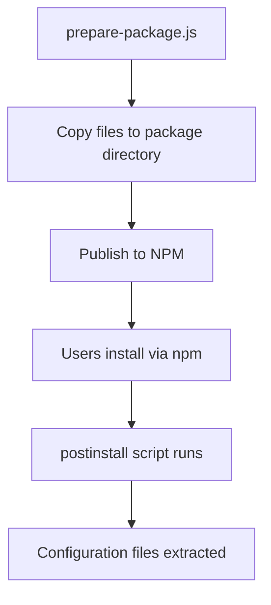
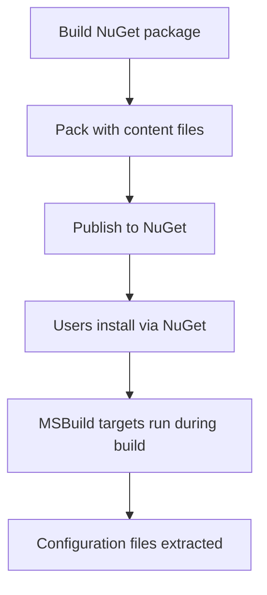

# Roo Code Memory Bank: Architecture Document

## 1. Executive Summary

The Roo Code Memory Bank is a system designed to maintain project context across sessions and memory resets for consistent AI-assisted development. It works alongside Roo Code's built-in context features to provide a more robust solution for managing project knowledge and ensuring consistent AI assistance.

This document provides a comprehensive overview of the system's architecture, including its technical implementation, user workflows, and integration with Roo Code.

## 2. System Overview

### 2.1 Purpose and Goals

The primary purpose of the Roo Code Memory Bank is to ensure persistence of project context across Roo's memory resets and to build long-term project knowledge. While Roo Code has built-in features for preserving context within a single VS Code workspace session, the Memory Bank provides a structured, well-documented repository for capturing and organizing vital project knowledge.

Key goals of the system include:
- Ensuring persistence across Roo's memory resets
- Building long-term project knowledge
- Establishing an explicit mode-based workflow
- Implementing project-specific rules with `.clinerules` files

### 2.2 Key Concepts

- **System Prompts**: Files that define the behavior of Roo's different modes (Architect, Code, Ask, Debug).
- **System Variables**: Environment-specific variables that are populated in system prompt files.
- **Configuration Sets**: Collections of system prompts and rules that can be selected and deployed.
- **.clinerules Files**: Files that define project-specific rules and coding patterns.
- **.roomodes File**: A file that defines custom modes for Roo.

## 3. Architecture Components

### 3.1 File Structure

### 3.2 NPM Package Implementation

The NPM package (`@automateeverything.cc/rools`) provides a way to distribute and install the Memory Bank configuration files. It includes:

- **extract-config.js**: Extracts configuration files to the project root.
- **prepare-package.js**: Prepares the package for publishing by copying configuration files.
- **populate-system-vars.js**: Populates system variables in system prompt files.
- **select-rools-set.js**: Allows selection and deployment of configuration sets.
- **cline-rules-extract.js**: A CLI tool for manually extracting configuration files.

### 3.3 NuGet Package Implementation

The NuGet package (`ClinerRules`) provides a way to distribute and install the Memory Bank configuration files in .NET projects. It includes:

- **ClinerRules.targets**: An MSBuild target that extracts configuration files to the project root.
- **RooCodeMemoryBank.targets**: An MSBuild target specifically for the Memory Bank files.

### 3.4 System Variables Management

System variables are environment-specific variables that are populated in system prompt files. They include:

- **CURRENT_WORKING_DIRECTORY**: The current working directory of the project.
- **HOME_DIRECTORY**: The user's home directory.
- **GLOBAL_CUSTOM_MODES_PATH**: Path to global custom modes configuration.
- **OPERATING_SYSTEM**: The user's operating system.
- **DEFAULT_SHELL**: The user's default shell.

These variables are managed by two scripts:
- **populate-system-vars.js**: Populates the variables with the current environment values.
- **wipe-system-vars.js**: Clears the variables (useful for version control).

### 3.5 Configuration Sets Management

Configuration sets are collections of system prompts and rules that can be selected and deployed. They are managed by the `select-rools-set.js` script, which:

1. Lists available configuration sets in the `.rools` directory.
2. Prompts the user to select a set.
3. Cleans the target directory by removing existing configuration files.
4. Copies the selected set's files to the project root.

## 4. User Workflows

### 4.1 Installation and Setup

### 4.2 Managing System Variables

### 4.3 Selecting Configuration Sets

### 4.4 Integration with Development Workflow

## 5. Integration with Roo Code

### 5.1 Complementing Built-in Features

The Memory Bank complements Roo Code's built-in context features:

- **Roo Code's built-in features**: Provide short-term and workspace-level context retention.
- **Memory Bank**: Serves as Roo's long-term and structured persistent memory.

### 5.2 Mode-based Workflows

The Memory Bank establishes explicit mode-based workflows for utilizing Roo Code's different modes:

- **Architect Mode**: For high-level planning and architecture decisions.
- **Code Mode**: For implementing code based on the architecture.
- **Ask Mode**: For asking questions and getting information.
- **Debug Mode**: For debugging issues in the code.

### 5.3 Project-specific Rules

The Memory Bank implements project-specific rules with `.clinerules` files, which define and consistently enforce project-specific rules and coding patterns.

## 6. Technical Implementation Details

### 6.1 NPM Package Internals

The NPM package works by:
1. Running the `extract-config.js` script during installation (via the postinstall script).
2. The script determines the source directory (where the package is installed) and the target directory (the root of the project that installed the package).
3. It copies all `.clinerules-*` files, the `.roo` directory, and the `.roomodes` file from the package to the target directory.
4. It then runs the `populate-system-vars.js` script to update system variables in the extracted files.

### 6.2 NuGet Package Internals

The NuGet package works by:
1. Defining MSBuild targets that run before the Build target.
2. The targets copy all files from the package's content directory to the project root.
3. This ensures that the configuration files are extracted every time the project is built.

### 6.3 Script Functionality

#### populate-system-vars.js
1. Gets system variables like the current working directory, home directory, default shell, and operating system.
2. Determines the global custom modes path based on the operating system.
3. Updates all system prompt files in the .roo directory with these system variables.

#### wipe-system-vars.js
1. Finds all system prompt files in the .roo directory.
2. Replaces all system variables with empty values.

#### select-rools-set.js
1. Lists all directories in the .rools directory.
2. Prompts the user to select a configuration set.
3. Cleans the target directory by removing the .roo directory, .roomodes file, and all .clinerules* files/directories.
4. Copies all files and directories from the selected configuration set to the target directory.

## 7. Deployment and Distribution

### 7.1 NPM Package Deployment

### 7.2 NuGet Package Deployment

## 8. Conclusion

The Roo Code Memory Bank is a comprehensive system for maintaining project context across sessions and memory resets. It provides a structured approach to managing project knowledge and ensuring consistent AI assistance. By working alongside Roo Code's built-in context features, it creates a powerful and robust development workflow.

The system's architecture is designed to be flexible and extensible, allowing for easy distribution and installation via NPM and NuGet packages. The use of configuration sets and system variables makes it adaptable to different environments and project requirements.