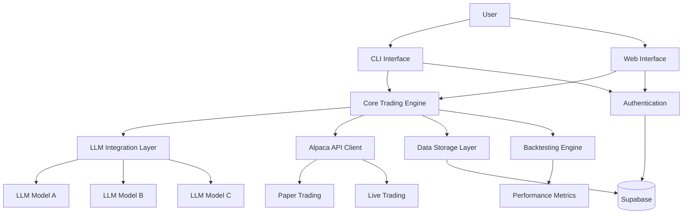
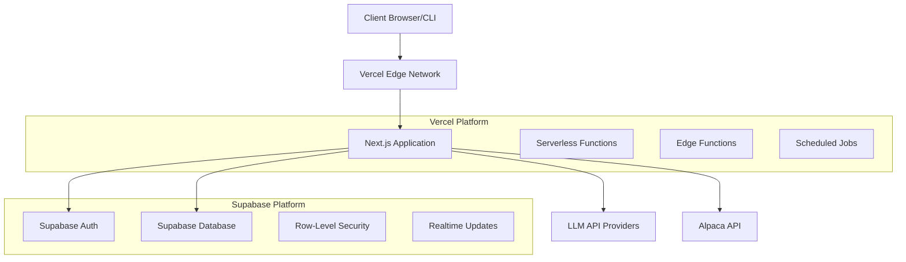

# Trading AI Agent Bot - Architecture Design

## System Overview

The Trading AI Agent Bot is a platform that leverages LLM models to make trading decisions for US stocks and ETFs using the Alpaca API. It supports paper trading for risk-free testing and backtesting for strategy evaluation. The system provides both CLI and web interfaces and is deployed on Vercel with Supabase for database and authentication.

## High-Level Architecture



## Component Descriptions

### User Interfaces
1. **CLI Interface**
   - Command-line tool for technical users
   - Direct access to trading functions, backtesting, and configuration
   - Scriptable for automation

2. **Web Interface**
   - Dashboard for monitoring trades and performance
   - Configuration interface for trading parameters
   - Visualization of backtesting results
   - Asset selection and management

### Core Components
3. **Core Trading Engine**
   - Central orchestration of trading activities
   - Strategy execution and management
   - Trading frequency determination with AI assistance
   - Asset selection processing
   - Trade execution via Alpaca API

4. **LLM Integration Layer**
   - Pluggable architecture for multiple LLM models
   - Model configuration and management
   - Prompt engineering for trading decisions
   - Response parsing and interpretation
   - Model performance tracking

5. **Alpaca API Client**
   - Authentication and secure API key management
   - Market data retrieval
   - Order placement and management
   - Account information access
   - Support for both paper and live trading

6. **Backtesting Engine**
   - Historical data management
   - Strategy simulation
   - Performance metrics calculation (returns, drawdowns, Sharpe ratio)
   - Results visualization and reporting

7. **Data Storage Layer**
   - Trading history persistence
   - User preferences and configurations
   - Model performance data
   - Backtesting results
   - Security and encryption management

### Infrastructure Components
8. **Authentication**
   - Supabase authentication integration
   - Role-based access control
   - Session management
   - Security policies

9. **Deployment Infrastructure**
   - Vercel for web application hosting
   - Supabase for database and authentication
   - Serverless functions for API endpoints
   - Scheduled jobs for recurring tasks

## Data Flow

1. **User Authentication Flow**
   ```mermaid
   sequenceDiagram
       User->>Interface: Login request
       Interface->>Supabase: Authentication request
       Supabase->>Interface: Auth token
       Interface->>User: Login confirmation
   ```

2. **Trading Decision Flow**
   ```mermaid
   sequenceDiagram
       User->>Interface: Configure trading parameters
       Interface->>Core: Trading request
       Core->>AlpacaAPI: Market data request
       AlpacaAPI->>Core: Market data
       Core->>LLM: Decision request with market data
       LLM->>Core: Trading decision
       Core->>AlpacaAPI: Execute trade
       AlpacaAPI->>Core: Trade confirmation
       Core->>DataStore: Store trade record
       Core->>Interface: Update UI
   ```

3. **Backtesting Flow**
   ```mermaid
   sequenceDiagram
       User->>Interface: Configure backtest
       Interface->>Backtester: Backtest request
       Backtester->>AlpacaAPI: Historical data request
       AlpacaAPI->>Backtester: Historical data
       Backtester->>LLM: Simulated decisions
       LLM->>Backtester: Trading signals
       Backtester->>Metrics: Calculate performance
       Metrics->>Backtester: Performance results
       Backtester->>DataStore: Store results
       Backtester->>Interface: Display results
   ```

## Technology Stack

### Frontend
- **Web**: Next.js (React framework for Vercel deployment)
- **CLI**: Node.js command-line tool
- **Visualization**: D3.js or Chart.js for performance metrics
- **State Management**: React Context or Redux

### Backend
- **API Layer**: Next.js API routes (serverless functions)
- **Authentication**: Supabase Auth
- **Database**: Supabase (PostgreSQL)
- **Scheduled Jobs**: Vercel Cron Jobs

### Integration
- **LLM Integration**: OpenAI API, Hugging Face, or custom endpoints
- **Trading API**: Alpaca API
- **Market Data**: Alpaca API, potentially additional sources

### Security
- **API Key Encryption**: Server-side encryption
- **Data Protection**: Row-level security in Supabase
- **Authentication**: JWT tokens with Supabase
- **Role-Based Access**: Supabase RLS policies

## Deployment Architecture



## Security Considerations

1. **API Key Management**
   - Encryption of Alpaca API keys at rest
   - Secure environment variables in Vercel
   - No client-side exposure of sensitive keys

2. **Authentication & Authorization**
   - Supabase authentication for user management
   - Role-based access control for different user types
   - Session management and token validation

3. **Data Protection**
   - Encryption of sensitive trading data
   - Row-level security in Supabase
   - Secure data transmission (HTTPS/TLS)

## Scalability Considerations

1. **Serverless Architecture**
   - Automatic scaling with Vercel serverless functions
   - No server management overhead
   - Pay-per-use cost model

2. **Database Scaling**
   - Supabase PostgreSQL scaling capabilities
   - Connection pooling for high-concurrency scenarios
   - Efficient query optimization

3. **LLM Integration Scaling**
   - Queue-based processing for high-volume LLM requests
   - Caching of common LLM responses
   - Fallback mechanisms for API rate limits

## Development Roadmap

1. **Phase 1: Foundation**
   - Core architecture implementation
   - Basic Alpaca API integration
   - Initial LLM model integration
   - Authentication setup

2. **Phase 2: Trading Capabilities**
   - Paper trading implementation
   - Basic backtesting engine
   - Asset selection interface
   - Trading frequency controls

3. **Phase 3: Interface Development**
   - CLI interface implementation
   - Web dashboard development
   - Performance visualization
   - Configuration management

4. **Phase 4: Advanced Features**
   - Multiple LLM model support
   - Enhanced backtesting capabilities
   - Advanced security features
   - Performance optimizations

## Open Questions and Considerations

1. How will the system handle market hours vs. after-hours trading?
2. What specific LLM models will be initially supported?
3. How will the system handle API rate limits from LLM providers?
4. What additional market data sources might be needed beyond Alpaca?
5. How will the system evaluate and compare different LLM models' performance?